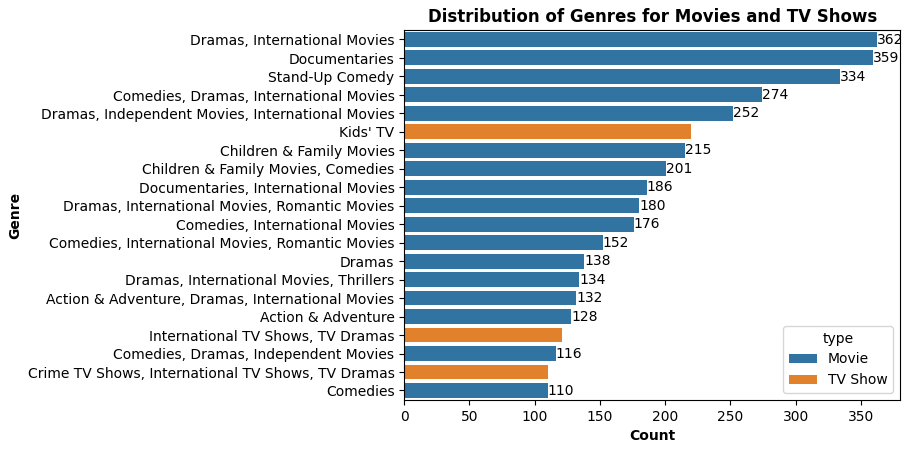
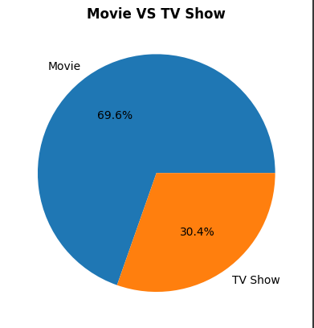
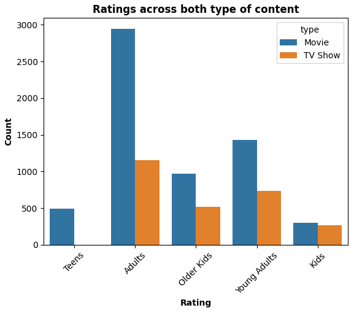

# Netflix Analysis 📺


[](https://colab.research.google.com/github/arcvrsh/Netflix-Analysis/blob/main/Netflix.ipynb)


---

## Overview

A comprehensive exploratory data analysis (EDA) of thousands of Netflix titles using Python and pandas. Discover trends by year, genre, country, and more!  
This project provides insights into Netflix's catalogue, top genres, prolific years, and regional trends, all with visually engaging plots.

---

## Business Problem

Analyze the data and generate insights that could help Netflix in deciding which type of shows/movies to produce and how they can grow the business in different countries

- How has the number of movies released per year changed over the last 20-30 years?
- Comparison of tv shows vs. movies.
- What is the best time to launch a TV show?
- Analysis of actors/directors of different types of shows/movies.
- Does Netflix has more focus on TV Shows than movies in recent years
- Understanding what content is available in different countries

## Table of Contents

- [Screenshots](#screenshots)
- [Usage](#usage)
- [Results](#results)
- [Contributing](#contributing)
- [License](#license)
- [References](#references)

---

## Screenshots

Here are some of the key visualizations generated from the analysis:




<!-- Add more screenshots as needed, for example:

-->

---

## Usage

### Run Online

- Launch the notebook with Google Colab:  
  [](https://colab.research.google.com/github/arcvrsh/Netflix-Analysis/blob/main/Netflix.ipynb)

### Run Locally

1. Clone this repository:
   ```bash
   git clone https://github.com/arcvrsh/Netflix-Analysis.git
   cd Netflix-Analysis
   ```
2. Install dependencies:
   ```bash
   pip install -r requirements.txt
   ```
3. Launch the Jupyter notebook:
   ```bash
   jupyter notebook Netflix.ipynb
   ```

---

## Results

- **8800+ titles analyzed**
- Top genres: Drama, Comedy, Action
- Most prolific years: 2017–2020
- Detailed genre and country distributions
- (Add your best charts or findings here!)

---

## Contributing

Pull requests are welcome! If you have suggestions for improvements or new analyses, please open an issue or submit a pull request.  
See [CONTRIBUTING.md](CONTRIBUTING.md) for more information.

---

## License

This project is licensed under the MIT License. See the [LICENSE](LICENSE) file for details.

---

## References

- Dataset: [Kaggle Netflix Titles](https://www.kaggle.com/shivamb/netflix-shows)
- Colab Notebook: [Open in Colab](https://colab.research.google.com/github/arcvrsh/Netflix-Analysis/blob/main/Netflix.ipynb)

---

*Enjoy exploring the world of Netflix data!*


